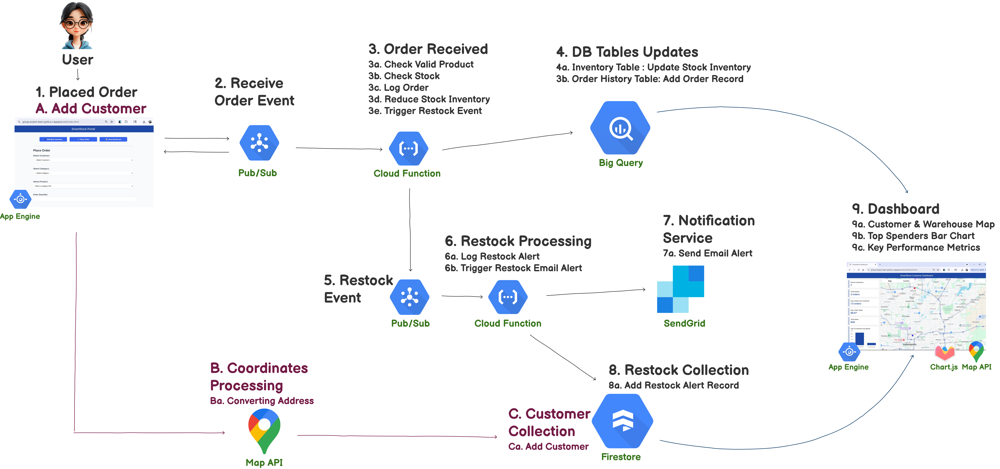

# SmartStock

**SmartStock** is a serverless, event-driven inventory management system designed to help small businesses monitor stock levels, process customer orders, and receive real-time low-stock alerts. It includes a simple internal UI, real-time analytics, and automated restock triggers — all built using BigQuery, Firestore, App Engine, Pub/Sub, and Cloud Functions.

The MVP supports order processing, inventory updates, restock alerts, and a live dashboard for sales and customer insights. It lays the foundation for future enhancements such as automated restocking and customer-facing ordering. It also supports adding new customers during order placement, including automatic address geocoding via the Google Maps API.

---


---
# Table of Contents
- [Features](#features)
- [Tech Stack](#tech-stack)
- [Project Structure](#project-structure)
- [Architecture Overview](#architecture-overview)
- [Databases Setup & Schema](#databases)
- [App Engine Configuration](#app-engine-configuration)
- [Dependencies](#dependencies)
- [Deployment Guide](#deployment-guide)
- [Project Status](#project-status)
- [Notes](#notes)
- [Contributors](#contributors)
- [License](#license)

---

## Features

- Add new customers and place orders through a simple internal UI (**App Engine frontend**)
- Show customer dropdown from **Firestore** and product dropdown from **BigQuery**
- Auto-geocode new customer address using **Google Maps API** (backend)
- Submit orders to **Pub/Sub** — triggers Cloud Function to validate, log order, and update inventory in **BigQuery**
- Low stock? Another Cloud Function is triggered to log restock in **Firestore**
- Low-stock email notifications sent using **SendGrid**
- **Dashboard** (part of the internal UI):
  - Sales and order insights (**BigQuery + Firestore + Chart.js**)
  - Map view of customers and warehouse locations (**Firestore + Google Maps**)
  - Top customer analytics (**BigQuery**)


---
## Tech Stack

| Component        | Technology              |
|------------------|--------------------------|
| Frontend         | HTML + CSS + Express (AppEngine) |
| Backend          | Node.js (Cloud Functions & Express) |
| Database         | BigQuery (Inventory + Orders) |
| NoSQL            | Firestore (Customers + Alerts) |
| Messaging        | Pub/Sub                 |
| Email            | SendGrid API            |
| Mapping (Frontend)          | Google Maps JavaScript API |
| Geocoding (Backend)          | Google Maps Geocoding API |

---

## Project Structure

```bash
finalproject/
│
├── appengine/               # Express app for internal UI + API
│   ├── index.js             # App entry point
│   ├── public/              # Static HTML form + CSS
│   ├── routes/              # Route handlers (/order, /customers, /map)
│   ├── services/            # BigQuery + Firestore helper functions
│   └── app.yaml             # App Engine deployment config
│
├── functions/
│   ├── orderProcessor/      # Cloud Function: processes orders, updates stock
│   └── restockHandler/      # Cloud Function: evaluates stock thresholds & triggers alerts
│
├── shared/                  # (Optional) Shared constants and utils
│   └── constants.js         # Pub/Sub topics, SKU thresholds, etc.
│
├── keys/                    # Service account keys (excluded from repo)
│   
├── data/                    # Sample customers JSON + import script, and inventory baseline CSV
│
├── Images/                  # Architecture and workflow diagrams
│
├── .env                     # Environment config (API keys, HQ_LAT, HQ_LNG, )
│
├── README.md                # Project documentation
└── .gitignore               # Ignore keys/, .env, and other sensitive files

```

---
## Architecture Overview

SmartStock uses a serverless, event-driven architecture on Google Cloud Platform (GCP).  
It automates order processing, stock updates, restock alerts, and real-time analytics by integrating App Engine, Pub/Sub, Cloud Functions, BigQuery, Firestore, SendGrid, and Google Maps APIs.  
The unified diagram below shows the end-to-end workflow—from order placement to live dashboards.




### System Workflow (1–9)

#### 1. Placed Order
A store staff member uses the App Engine web UI to place an order.  
The form loads customer data from Firestore and product data from BigQuery. If a customer is missing, the user can add one (see A–C).

#### 2. Receive Order Event
On submission, the order is published to a Pub/Sub topic (`order-topic`).  
This decouples the UI from backend processing and enables asynchronous handling.

#### 3. Order Received
A Cloud Function (`orderProcessor`) processes the message:
- Validates product existence and stock availability.
- Updates inventory quantities in `inventory_baseline` table (BigQuery).
- Logs the order to an `order_history` table (BigQuery).
- If stock drops below a threshold, publishes a restock event.

#### 4. finalproject DB Table Updates
BigQuery stores and updates:
- `inventory_baseline` table with current stock levels.
- `order_history` table with product, customer, quantity, and timestamp.

#### 5. Restock Event
If an item falls below threshold, a Pub/Sub message is published to a `restock-topic` to drive restock handling.

#### 6. Restock Processing
A Cloud Function (`restockHandler`) consumes the restock event and:
- Logs a restock alert in `restock_log` collection (Firestore).
- Sends a low-stock notification via SendGrid.

#### 7. Notification Service
SendGrid delivers the email alert with product details.

#### 8. restock_log Collection
Firestore keeps a permanent record of restock alerts and events for audit and trend analysis.

#### 9. Dashboard
When the dashboard loads, the App Engine frontend (dashboard.html) initializes three parallel processes:
##### 9a. Map Panel (initialized on load)
- Fetches customer coordinates from Firestore via `/map/locations`  
- Renders markers using **Google Maps JavaScript API**  
  - 🔴 Red = Customers  
  - 🔵 Blue = Warehouse  
  - Hover displays location name with an `InfoWindow`

##### 9b. Chart Panel (initialized on load)
- Aggregates total spend per customer from **BigQuery**  
- Fetches customer names from **Firestore**  
- Renders **Top 5 customers** in a bar chart using **Chart.js**

##### 9c. Metrics Panel (initialized on load)
- Loads real-time metrics via API endpoints:  
  - `/customers/active-count`  
  - `/customers/order-count`  
  - `/customers/average-orders`  
  - `/customers/average-order-value`  
  - `/customers/total-order-value`

### Customer Subprocesses (A–C)

#### A. Add Customer
If the customer does not exist, staff add the record through the App Engine form (name, address, contact).

#### B. Coordinates Processing
The address is sent to the Google Maps Geocoding API to obtain latitude/longitude for mapping and analytics.

#### C. customer Collection
The complete customer record (details + coordinates) is stored in `customers` collection (Firestore) for future orders and dashboard visualization.

-----
## Databases

### Database Setup
SmartStock uses both **BigQuery** and **Firestore** to manage operational and analytical data.  
The data model supports event-driven updates, real-time analytics, and dashboard visualization.

> **Note:** Before deployment, ensure BigQuery is initialized properly. Firestore will be created and populated automatically when the first customer/order events occur.

#### BigQuery
SmartStock uses a BigQuery dataset (`finalproject`) for structured analytical data. BigQuery tables must be created **before deployment** so Cloud Functions can read and update them.  

For this project, the tables were created manually in the Google Cloud Console under the **`finalproject`** dataset, which includes:  
- `inventory_baseline`  
- `order_history`

The `inventory_baseline` table was loaded during creation using the initial CSV file (stored in the `data` folder), allowing BigQuery to automatically detect and apply the correct schema.

> **Note:** This setup can also be automated through a deployment or initialization script if needed in future versions.

#### Firestore
SmartStock uses a Firestore database (`smartstock-db`) for real-time event-driven data. The Firestore database **`smartstock-db`**  collections don't have to be created before deployment. 

Collections are created automatically when data is first written to Firestore:  
- `customers` — created when a new customer is added through the App Engine UI or initial data import script.  
- `restock_log` — created when the `restockHandler` Cloud Function logs the first low-stock alert.  

For this project, the initial customer data was loaded using the `data/importFirestore.js` script.  

### Database Schema

The following tables and collections define the SmartStock data model, supporting event-driven updates, real-time analytics, and dashboard visualization.

#### **BigQuery Dataset: `finalproject`**

##### `inventory_baseline`
Stores all product and stock information.

| Field Name | Data Type | Mode | Description |
|-------------|------------|------|--------------|
| `product_id` | STRING | REQUIRED | Unique product identifier (used for joins with orders). |
| `product_name` | STRING | REQUIRED | Display name for product. |
| `category` | STRING | NULLABLE | Product category (used in analytics). |
| `stock_quantity` | INTEGER | REQUIRED | Current stock available. |
| `reorder_level` | INTEGER | NULLABLE | Minimum quantity before restock. |
| `reorder_quantity` | INTEGER | NULLABLE | Default restock quantity. |
| `unit_price` | FLOAT | REQUIRED | Price per unit. |
| `date_received` | DATE | NULLABLE | Date added to inventory. |
| `last_order_date` | DATE | NULLABLE | Last time stock changed. |
| `sales_volume` | INTEGER | NULLABLE | Total units sold. |
| `status` | STRING | REQUIRED | Product status (`Active`, `Discontinued`, `Backordered`). |

##### `order_history`
Stores customer orders processed through App Engine and Cloud Functions.

| Field Name | Data Type | Mode | Default Value | Description |
|-------------|------------|------|----------------|--------------|
| `order_id` | STRING | REQUIRED | Auto-generated (UUID) | Unique order ID. |
| `customer_id` | STRING | REQUIRED | — | Firestore reference to customer. |
| `product_id` | STRING | REQUIRED | — | BigQuery reference to product. |
| `product_name` | STRING | NULLABLE | Derived on backend | Product name. |
| `quantity_ordered` | INTEGER | REQUIRED | — | Quantity ordered. |
| `unit_price` | FLOAT | NULLABLE | Derived on backend | Unit price. |
| `total_price` | FLOAT | NULLABLE | Calculated on backend | Total = quantity * price. |
| `timestamp` | DATE | REQUIRED | Current timestamp | Order creation date. |
| `order_status` | STRING | REQUIRED | Pending | Order lifecycle status. |

---

#### **Firestore Database: `smartstock-db`**

##### Collection: `customers` 
| Field Name | Data Type | Required | Description |
|-------------|------------|-----------|--------------|
| `customer_id` | STRING | Yes | Unique customer identifier. |
| `name` | STRING | Yes | Full name. |
| `email` | STRING | Optional | Email address. |
| `phone` | STRING | Optional | Contact number. |
| `address` | STRING | Yes | Street/city address. |
| `location` | GeoPoint | Yes | Latitude and longitude for map visualization. |
| `registered_date` | TIMESTAMP | Yes | Date added to the system. |
| `status` | STRING | Optional | `Active` or `Inactive`. |

##### Collection: `restock_log` 
| Field Name | Data Type | Required | Description |
|-------------|------------|-----------|--------------|
| `product_id` | STRING | Yes | Product ID from inventory. |
| `product_name` | STRING | Yes | Product name. |
| `stock_quantity` | INTEGER | Yes | Quantity when alert triggered. |
| `reorder_level` | INTEGER | Yes | Threshold that triggered the alert. |
| `reorder_quantity` | INTEGER | Yes | Recommended reorder amount. |
| `timestamp` | TIMESTAMP | Yes | Time alert was created. |
| `status` | STRING | Yes | Alert status (`unread`, `acknowledged`, `resolved`). |

---

## App Engine Configuration

Before deployment, review the **`app.yaml`** file in the `appengine/` directory and update all required environment variables with your project-specific values.

> **Note:** The `HQ_LAT` and `HQ_LNG` values correspond to the warehouse location used for the map marker on the dashboard.

-----

## Dependencies

### App Engine (Node.js)
- express – Web server for frontend and routes
- body-parser – Parses JSON request bodies
- @google-cloud/bigquery – Communicates with BigQuery
- @google-cloud/firestore – Communicates with Firestore
- @google-cloud/pubsub – Publishes messages to Pub/Sub
- dotenv – Loads environment variables from .env
- @sendgrid/mail – Sends emails via SendGrid
- node-fetch – Enables backend geocoding requests to Google Maps API

### Cloud Functions

- orderProcessor
  - @google-cloud/pubsub
  - @google-cloud/bigquery

- restockHandler
  - @google-cloud/bigquery
  - @google-cloud/firestore
  - @sendgrid/mail
 
> ⚠️ Important: Ensure your `.env` file and service account keys are excluded from Git tracking (`.gitignore`) before deploying.

---
## Deployment Guide

### Environment Setup

```bash
# .env (DO NOT COMMIT)
SENDGRID_API_KEY=your_key
GOOGLE_APPLICATION_CREDENTIALS=./keys/your-key.json
GOOGLE_MAPS_API_KEY=your_google_maps_key
HQ_LAT=xx.xxxx
HQ_LNG=xx.xxxx
```

### Deploy App Engine
```bash
cd appengine
gcloud app deploy app.yaml 
```

### Deploy Cloud Functions

#### Deploy orderProcessor
```bash
cd functions/orderProcessor
gcloud functions deploy orderProcessor \
  --gen2 \
  --runtime=nodejs20 \
  --entry-point=orderProcessor \
  --trigger-topic=order-topic \
  --source=. \
  --region=us-central1
```

#### Deploy restockHandler
```bash
cd functions/restockHandler
gcloud functions deploy restockHandler \
  --gen2 \
  --runtime=nodejs20 \
  --entry-point=restockHandler \
  --trigger-topic=restock-topic \
  --source=. \
  --region=us-central1 \
  --set-env-vars SENDGRID_API_KEY=<paste-your-sendgrid-api-key-here>
```

---

## Project Status
We completed all MVP requirements for the course, successfully implementing core SmartStock functionality.
However, there are several additional enhancements possible to expand this platform into a more comprehensive, production-ready system.

### Completed (MVP Features):
- [x] Order placement flow
- [x] New customer creation with geocoding
- [x] BigQuery inventory updates
- [x] Restock alerts logged
- [x] Email notification (SendGrid)
- [x] Key metrics and analytics dashboard

### Possivle Enhancements (Next Phase):
- [ ] Customer self-service ordering portal
- [ ] Automated restocking integration
- [ ] Enhanced dashboards (Sales & Inventory)
- [ ] Supplier management module
- [ ] Access control & security layer

---

## Notes

- `shared/constants.js` is prepared for reusable configuration but not wired in yet.
- The `sendgrid` email function is tested and active in `restockHandler`.
- Dashboard uses Google Maps API and Chart.js for real-time analytics

---
## Contributors

- Mehul Thawre – Frontend (App Engine & UI/API Layer)
- Glen Roger Allman – Middleware / Integration Logic (Cloud Functions + Pub/Sub)
- Anna Bajszczak – Architecture / Backend / Data & Infrastructure
  
---
## License

This project was developed as part of the **Data-Driven Cloud Applications** course at Purdue University, thought by William Remeika.  
It is intended for educational use and demonstration purposes only.  
All rights reserved.
