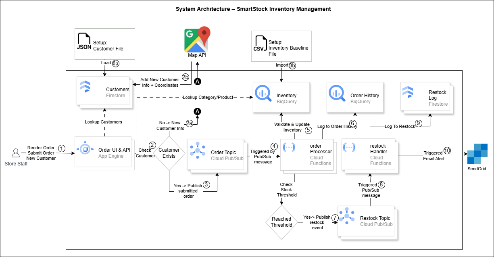
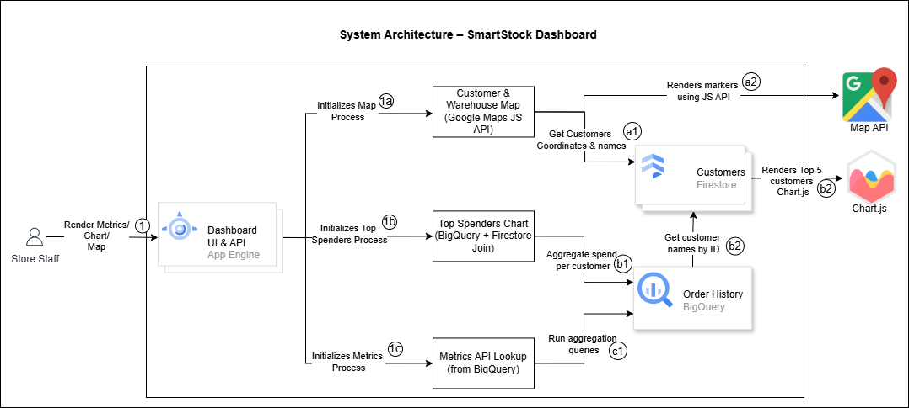

# SmartStock

**SmartStock** is a serverless, event-driven inventory management system designed to help small businesses monitor stock levels, process customer orders, and receive real-time low-stock alerts. It includes a simple internal UI, real-time analytics, and automated restock triggers — all built using BigQuery, Firestore, App Engine, Pub/Sub, and Cloud Functions.

The MVP supports order processing, inventory updates, restock alerts, and a live dashboard for sales and customer insights. It lays the foundation for future enhancements such as automated restocking and customer-facing ordering. It also supports adding new customers during order placement, including automatic address geocoding via the Google Maps API.

---


---
# Table of Contents
- [Features](#features)
- [Tech Stack](#tech-stack)
- [Project Structure](#project-structure)
- [Architecture Overview](#architecture-overview)
- [Dependencies](#dependencies)
- [Deployment Guide](#deployment-guide)
- [Project Status](#project-status)
- [Notes](#notes)
- [Contributors](#Contributors)
- [License](#license)

---

## Features

- Add new customers and place orders through a simple internal UI (**App Engine frontend**)
- Show customer dropdown from **Firestore** and product dropdown from **BigQuery**
- Auto-geocode new customer address using **Google Maps API** (backend)
- Submit orders to **Pub/Sub** — triggers Cloud Function to validate, log order, and update inventory in **BigQuery**
- Low stock? Another Cloud Function is triggered to log restock in **Firestore**
- Low-stock email notifications sent using **SendGrid**
- **Dashboard** (part of the internal UI):
  - Sales and order insights (**BigQuery + Chart.js**)
  - Map view of customers and warehouse locations (**Firestore + Google Maps**)
  - Top customer analytics (**BigQuery**)


---
## Tech Stack

| Component        | Technology              |
|------------------|--------------------------|
| Frontend         | HTML + CSS + Express (AppEngine) |
| Backend          | Node.js (Cloud Functions & Express) |
| Database         | BigQuery (Inventory + Orders) |
| NoSQL            | Firestore (Customers + Alerts) |
| Messaging        | Pub/Sub                 |
| Email            | SendGrid API            |
| Mapping (Frontend)          | Google Maps JavaScript API |
| Geocoding (Backend)          | Google Maps Geocoding API |

---

## Project Structure

```bash
finalproject/
│
├── appengine/               # Express app for internal UI + API
│   ├── index.js             # App entry point
│   ├── public/              # Static HTML form + CSS
│   ├── routes/              # Route handlers (/order, /customers, /map)
│   ├── services/            # BigQuery + Firestore helper functions
│   └── app.yaml             # App Engine config
│
├── functions/
│   ├── orderProcessor/      # Processes orders, updates stock
│   └── restockHandler/      # Evaluates stock thresholds & triggers alerts
│
├── shared/                  # (Optional) Shared constants and utils
│   └── constants.js         # Pub/Sub topics, thresholds
│
├── keys/                    # .env and service account keys (not committed)
│
├── data/                    # Preloaded customers and inventory setup
│
├── Images/                  # Architecture diagrams
│
├── README.md                 # Project documentation
└── .gitignore                # Ignore keys/ and .env files
```

---
## Architecture Overview

The SmartStock platform consists of two main subsystems:

- **A. Inventory Management**: Handles ordering, stock updates, and restocking via Pub/Sub and Cloud Functions.
- **B. Dashboard & Analytics**: Displays live customer activity, sales metrics, and mapping using Firestore and BigQuery.
  
Each subsystem is documented below with its architecture diagram and workflow.

---
### A. SmartStock Inventory Management (Ordering & Stock Updates)



#### How It Works 

**0. Preloading initial data**
   - 0a. Customer profiles preloaded into Firestore using JSON file
   - 0b. Inventory data uploaded into BigQuery using CSV file.

**1. Store staff accesses the App Engine frontend, which loads:**
   - Customers pulled from Firestore
   - Categories & products pulled from BigQuery
   - Option to **Add New Customer** if not found in dropdown

**2. User adds a new customer (if not found)**
   - 2a. The system temporarily holds the entered information and sends the address to the **Google Maps Geocoding API**
   - 2b. The full customer record (with coordinates) is stored in Firestore

**3. User submits the order**
   - Order includes `user_id`, `product_id`, and quantity
   - App Engine sends it to `order-topic` via Pub/Sub

**4. Cloud Function: orderProcessor (Triggered by `order-topic`)**
   
**5. Validates Product Availability / Updates stock quantity in BigQuery**
   - Validates product availability using BigQuery (Inventory)
   - Decreases inventory count for ordered product
  
**6. Logs order in BigQuery**
   - Writes to `order_history` table

**7. Publishes to `restock-topic` if stock is below threshold**

**8. Cloud Function: restockHandler (Triggered by `restock-topic`)**
   - Checks threshold and prepares alert

**9. Logs restock alert in Firestore**
   - Writes to `restock_log` collection

**10. Sends low-stock alert email via SendGrid**
   - Includes product name and suggested reorder

---
### B. SmartStock Dashboard & Analytics (Live Metrics & Mapping)



#### How It Works 

When the dashboard loads, the App Engine frontend (`dashboard.html`) initializes three parallel processes:

**1a. Map panel initialized when dashboard loads**
- a1. Fetches customer coordinates from Firestore via `/map/locations`
- a2. Renders markers using Google Maps JavaScript API  
  - Red = Customers  
  - Blue = Warehouse  
  - Hover displays location name with InfoWindow

**1b. Chart panel initialized when dashboard loads**
- b1. Aggregates total spend per customer from BigQuery
- b2. Fetches customer names from Firestore
- b3. Renders Top 5 customers in a bar chart using Chart.js

**1c. Metrics panel initialized when dashboard loads**
- c1. Loads real-time metrics via API endpoints:
  - `/customers/active-count`
  - `/customers/order-count`
  - `/customers/average-orders`
  - `/customers/average-order-value`
  - `/customers/total-order-value`
---

## Dependencies

### App Engine (Node.js)
- express – Web server for frontend and routes
- body-parser – Parses JSON request bodies
- @google-cloud/bigquery – Communicates with BigQuery
- @google-cloud/firestore – Communicates with Firestore
- @google-cloud/pubsub – Publishes messages to Pub/Sub
- dotenv – Loads environment variables from .env
- @sendgrid/mail – Sends emails via SendGrid
- node-fetch – Enables backend geocoding requests to Google Maps API

### Cloud Functions

- orderProcessor
  - @google-cloud/pubsub
  - @google-cloud/bigquery

- restockHandler
  - @google-cloud/bigquery
  - @google-cloud/firestore
  - @sendgrid/mail
 
> ⚠️ Important: Ensure your `.env` file and service account keys are excluded from Git tracking (`.gitignore`) before deploying.

---
## Deployment Guide

### Environment Setup

```bash
# .env (DO NOT COMMIT)
SENDGRID_API_KEY=your_key
GOOGLE_APPLICATION_CREDENTIALS=./keys/your-key.json
GOOGLE_MAPS_API_KEY=your_google_maps_key
HQ_LAT=xx.xxxx
HQ_LNG=xx.xxxx
```

### Deploy App Engine
```bash
cd appengine
gcloud app deploy app.yaml 
```

### Deploy Cloud Functions

#### Deploy orderProcessor
```bash
cd functions/orderProcessor
gcloud functions deploy orderProcessor \
  --gen2 \
  --runtime=nodejs20 \
  --entry-point=orderProcessor \
  --trigger-topic=order-topic \
  --source=. \
  --region=us-central1
```

#### Deploy restockHandler
```bash
cd functions/restockHandler
gcloud functions deploy restockHandler \
  --gen2 \
  --runtime=nodejs20 \
  --entry-point=restockHandler \
  --trigger-topic=restock-topic \
  --source=. \
  --region=us-central1 \
  --set-env-vars SENDGRID_API_KEY=<paste-your-sendgrid-api-key-here>
```

---

## Project Status
We completed all MVP requirements for the course, successfully implementing core SmartStock functionality.
However, there are several additional enhancements possible to expand this platform into a more comprehensive, production-ready system.

### Completed (MVP Features):
- [x] Order placement flow
- [x] New customer creation with geocoding
- [x] BigQuery inventory updates
- [x] Restock alerts logged
- [x] Email notification (SendGrid)
- [x] Key metrics and analytics dashboard

### Possivle Enhancements (Next Phase):
- [ ] Customer self-service ordering portal
- [ ] Automated restocking integration
- [ ] Enhanced dashboards (Sales & Inventory)
- [ ] Supplier management module
- [ ] Access control & security layer

---

## Notes

- `shared/constants.js` is prepared for reusable configuration but not wired in yet.
- The `sendgrid` email function is tested and active in `restockHandler`.
- Dashboard uses Google Maps API and Chart.js for real-time analytics

---
## Contributors

- Mehul Thawre – Frontend (App Engine & UI/API Layer)
- Glen Roger Allman – Middleware / Integration Logic (Cloud Functions + Pub/Sub)
- Anna Bajszczak – Architecture / Backend / Data & Infrastructure
  
---
## License

This project was developed as part of the **Data-Driven Cloud Applications** course at Purdue University, thought by William Remeika.  
It is intended for educational use and demonstration purposes only.  
All rights reserved.
